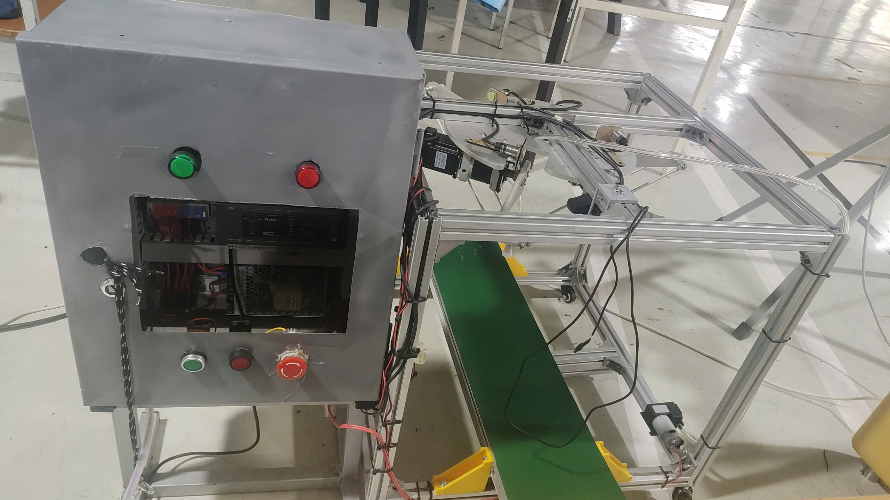
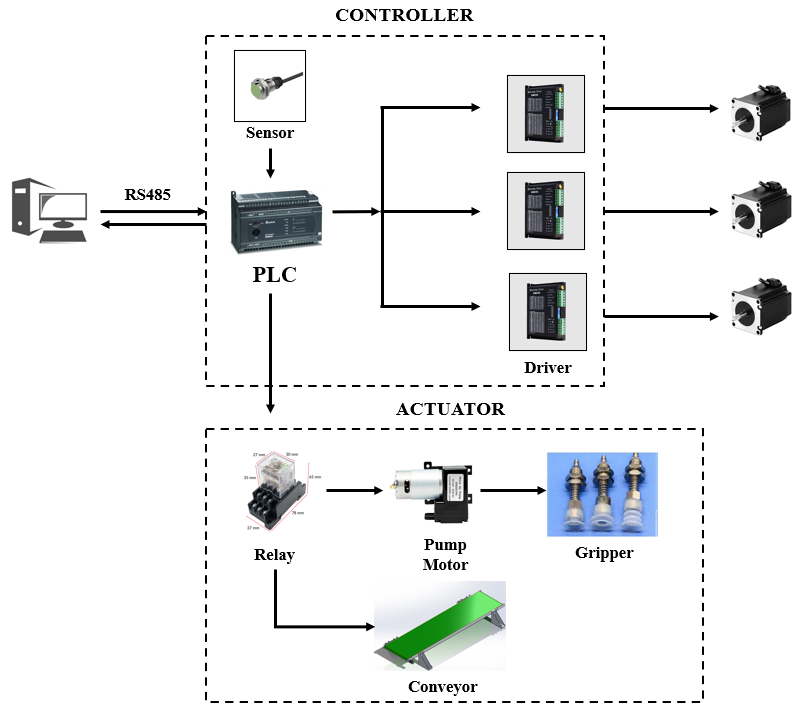
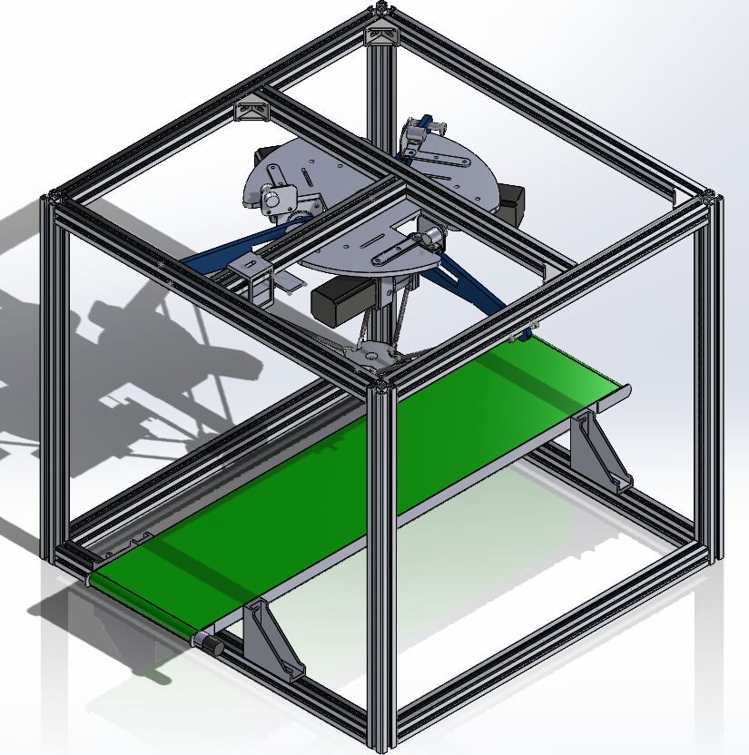
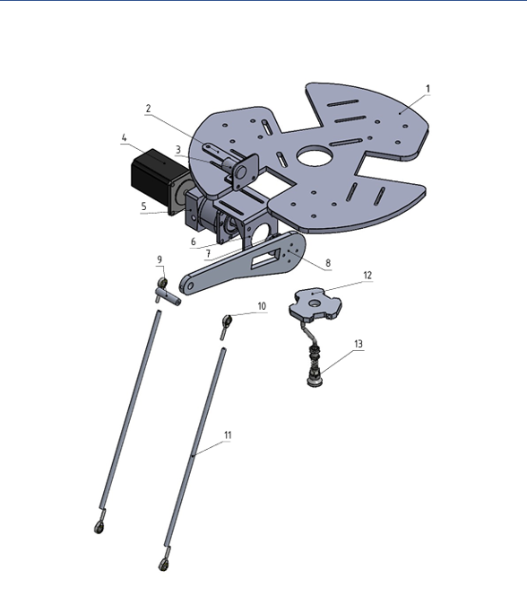
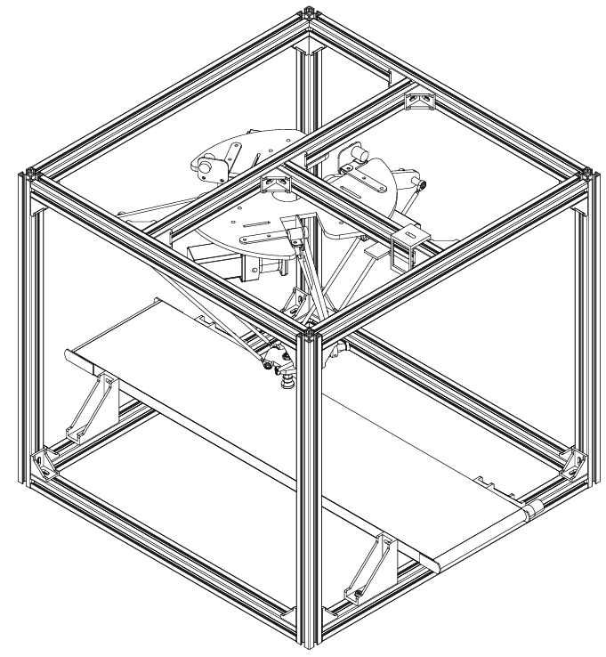

/># 🤖 DELTA ROBOT – AUTOMATED PICKING AND SORTING SYSTEM

> **Graduation Project – Design, Fabrication, and Control of a DELTA Robot Integrated with Computer Vision, PLC, and C# Software**

---

## 📌 1. Project Overview

This project focuses on the **design, fabrication, and control of a 3-DOF DELTA Robot** for an automated product picking and sorting application.

The system integrates multiple engineering fields, including:

* Mechanical design and fabrication of the DELTA Robot.
* Electrical system design and control.
* PLC programming.
* C# software development for system control and monitoring.
* Camera-based image processing.
* Forward Kinematics (FK) and Inverse Kinematics (IK).
* Servo motor control.
* Pneumatic and vacuum gripping systems.
* Communication between C# software and PLC.

### 🎯 Project Objectives

The main objective of this project is to develop a DELTA Robot system capable of:

1. Detecting and identifying products using a camera.
2. Determining the position of detected products.
3. Transmitting the processed data to the control system.
4. Moving the DELTA Robot to the required picking position.
5. Gripping products using a vacuum suction mechanism.
6. Moving and placing products at their corresponding sorting positions.
7. Providing an interface for operators to monitor and control the system.



---

# ⚙️ 2. Main Technical Specifications

| Parameter              | Specification          |
| ---------------------- | ---------------------- |
| Robot type             | DELTA Robot            |
| Degrees of freedom     | 3 DOF                  |
| Overall dimensions     | **660 × 660 × 600 mm** |
| Workspace              | Cylindrical            |
| Workspace radius       | **Rc = 200 mm**        |
| Workspace height       | **H = 225 mm**         |
| End-effector           | Vacuum suction gripper |
| Drive system           | Servo motors           |
| Main controller        | PLC                    |
| Control software       | C#                     |
| Vision system          | Camera                 |
| C# – PLC communication | Modbus                 |
| Mechanical design      | SolidWorks             |


---

# 🏗️ 3. Overall System Architecture

The system is developed as an integrated architecture consisting of the **Camera, Computer, PLC, Servo Drives, DELTA Robot, and pneumatic/vacuum system**.

```text
                    ┌─────────────────┐
                    │     CAMERA      │
                    │  Image Capture  │
                    └────────┬────────┘
                             │
                             ▼
                    ┌─────────────────┐
                    │       C#        │
                    │ Control & Image │
                    │    Processing   │
                    └────────┬────────┘
                             │
                       Modbus / TCP
                             │
                             ▼
                    ┌─────────────────┐
                    │       PLC       │
                    │ System Control  │
                    └───────┬─────────┘
                            │
              ┌─────────────┴─────────────┐
              ▼                           ▼
      ┌───────────────┐           ┌───────────────┐
      │  Step Drive   │           │ Solenoid Valve│
      └───────┬───────┘           └───────┬───────┘
              │                           │
              ▼                           ▼
      ┌───────────────┐           ┌───────────────┐
      │  Step Motor   │           │ Vacuum System │
      └───────┬───────┘           └───────┬───────┘
              │                           │
              └─────────────┬─────────────┘
                            ▼
                    ┌─────────────────┐
                    │   DELTA ROBOT   │
                    │   Pick & Sort   │
                    └─────────────────┘
```




### 🔄 General Operating Principle

The general operating sequence of the system is:

```text
System Startup
      ↓
System Status Check
      ↓
Camera Detects Product
      ↓
Product Identification & Position Detection
      ↓
Data Transmission to Control System
      ↓
Robot Position Calculation
      ↓
PLC Controls Step Motors
      ↓
Robot Moves to Picking Position
      ↓
Vacuum Gripper Activated
      ↓
Product Picked
      ↓
Robot Moves to Sorting Position
      ↓
Product Released
      ↓
Cycle Completed
```

---

# 🦾 4. Mechanical Design

The mechanical structure of the DELTA Robot was designed and developed using **SolidWorks**.

The main mechanical components include:

* Robot frame and base.
* Three servo motor assemblies.
* Three upper arms.
* Parallel linkage arms.
* End-effector mechanism.
* Vacuum suction mechanism.
* Supporting and connecting components.

The mechanical design was developed based on several requirements:

* Required workspace.
* Robot motion range.
* Structural rigidity.
* Assembly and maintenance requirements.
* End-effector mass.
* Required motion performance.
Mechanical Design










---

# 📐 5. Robot Workspace

The DELTA Robot is designed with a **cylindrical workspace** based on the specified mechanical dimensions.

The designed workspace has:

* Workspace radius: **Rc = 200 mm**
* Workspace height: **H = 225 mm**


---

# ⚡ 6. Electrical and Control System

The electrical system is designed to provide reliable control of the Robot, process sensor signals, control the servo motors, and operate the pneumatic and vacuum components.

### Main Components

* PLC.
* Servo Drives.
* Servo Motors.
* Control power supply.
* Sensors.
* Solenoid valves.
* Vacuum pump.
* Camera.
* Electrical protection and switching devices.
* Communication interfaces.

### Control Architecture

```text
             Computer / C#
                   │
                   │ Communication
                   ▼
                  PLC
                   │
        ┌──────────┼──────────┐
        ▼          ▼          ▼
       Step     Sensors     Valve
        │
        ▼
    DELTA Robot
```


---

# 💻 7. C# Control Software

The control and monitoring software is developed in **C#**.

The software provides a graphical user interface (GUI) for operating and monitoring the Robot system.

The main functions include:

### 🔐 Login

Provides user authentication before accessing the control functions.


### 🏠 Home


Returns the Robot to its initial position and checks the system status.


### 🎮 Manual Control

Allows the operator to manually control the Robot.


### 📐 IK / FK

The software supports:

* **Forward Kinematics (FK)** – calculating the end-effector position from the joint angles.
* **Inverse Kinematics (IK)** – calculating the required joint angles from the desired end-effector position.


### 📋 Position Table

Allows the operator to configure and execute a sequence of predefined Robot positions.


### 🤖 Automatic Mode

The automatic mode allows the system to perform the complete product picking and sorting cycle automatically.


---

# 📷 8. Computer Vision System

A camera is used to capture product images and provide the information required for the automatic sorting process.

The general image processing workflow is:

```text
Camera
  ↓
Image Acquisition
  ↓
Image Pre-processing
  ↓
Image Analysis
  ↓
Product Identification
  ↓
Position Detection
  ↓
Data Transmission to Control System
```

<!-- 🖼️ INSERT IMAGE: Image processing interface -->

<!-- 🖼️ INSERT IMAGE: Camera view of detected products -->

<!-- 🖼️ INSERT IMAGE: Product detection / classification result -->

---

# 🔌 9. C# – PLC Communication

Communication between the C# application and the PLC is one of the key functions of the system.

The **C# application** is responsible for:

* Providing the control interface.
* Processing input data.
* Performing position calculations.
* Processing camera information.
* Sending control commands to the PLC.
* Receiving system status information from the PLC.

The **PLC** is responsible for:

* Executing the control sequence.
* Controlling the servo system.
* Processing I/O signals.
* Controlling pneumatic and vacuum devices.
* Providing system feedback.

```text
             C# APPLICATION
                   │
                   │
                Modbus
                   │
                   ▼
                  PLC
                   │
        ┌──────────┼──────────┐
        ▼          ▼          ▼
     Servo       Sensor      Valve
        │
        ▼
    DELTA Robot
```

> **The complete source code and communication libraries are stored separately on Google Drive to keep the GitHub repository lightweight and easy to access.**

---

# 🧮 10. Robot Kinematics and Motion Control

The system uses kinematic equations to establish the relationship between the Robot joint angles and the end-effector position.

### Forward Kinematics (FK)

Forward Kinematics is used to determine the end-effector position from the known joint angles.

```text
θ1, θ2, θ3
     ↓
     FK
     ↓
  X, Y, Z
```

### Inverse Kinematics (IK)

Inverse Kinematics is used to determine the required joint angles from the desired end-effector position.

```text
 X, Y, Z
     ↓
     IK
     ↓
 θ1, θ2, θ3
```

---

# 🏭 11. Automatic Operating Cycle

The system operates through the following automatic sequence:

### Step 1 – System Startup

The system checks the power supply, PLC, servo drives, sensors, and other related devices.

### Step 2 – Homing

The Robot returns to its predefined initial position.

### Step 3 – Product Detection

The camera captures an image and detects the product.

### Step 4 – Position Calculation

The system determines the required picking position and calculates the corresponding Robot motion.

### Step 5 – Picking

The Robot moves to the product position and activates the vacuum suction mechanism.

### Step 6 – Sorting

The Robot moves the product to the corresponding sorting position.

### Step 7 – Product Release

The vacuum system is controlled to release the product at the target position.

### Step 8 – Next Cycle

The Robot returns to the ready position and starts the next cycle.


---

# 📊 12. Project Results

The developed system successfully integrates the following major components:

| Function                      | Status      |
| ----------------------------- | ----------- |
| DELTA Robot mechanical design | ✅ Completed |
| 3D CAD model                  | ✅ Completed |
| Mechanical drawings           | ✅ Completed |
| Electrical system             | ✅ Completed |
| PLC programming               | ✅ Completed |
| C# control software           | ✅ Completed |
| C# – PLC communication        | ✅ Completed |
| Servo motor control           | ✅ Completed |
| IK / FK calculation           | ✅ Completed |
| Image processing              | ✅ Completed |
| Automatic operation           | ✅ Completed |
| Product picking               | ✅ Completed |
| Product sorting               | ✅ Completed |


---

# 🎥 13. Demonstration Video

The demonstration video is stored externally to keep the GitHub repository lightweight.

▶️ **Demo Video:** **[🔗 Youtube](https://youtu.be/10hCros1-0s?si=66yPnu68rbqmf5BI)**

The demonstration includes:

* System startup.
* Robot homing.
* Manual control.
* IK / FK calculation.
* Position table operation.
* Image processing.
* Automatic operation.
* Product picking and sorting.


---

# 📄 14. Project Documentation

Because some design files, source code, and project documents are relatively large, the complete project files are stored externally.

### 📁 Google Drive

**[🔗 Access Complete Project Files](https://drive.google.com/drive/folders/1acIRnmZN9rkpttabnRZ9SYvg-8MFvuos?usp=drive_link)**

The folder contains:

```text
📁 C# Source Code & C# – PLC Communication Libraries
📁 PLC Program
📁 SolidWorks Files
📁 Mechanical Drawings
📁 Electrical Drawings
📁 Graduation Project Report
📁 Presentation Slides & Demonstration Videos
```

### 📘 Project Report

**[🔗 View / Download Project Report](https://drive.google.com/drive/folders/1jhONOlfQdbjyHl7gKiDh_cfU6idxjVZu?usp=drive_link)**

---


# 🧰 15. Technologies Used

### Software

* **C# / .NET**
* **Visual Studio**
* **PLC Programming**
* **ISPSoft**
* **SolidWorks**
* **Computer Vision / Image Processing**

### Hardware

* 3-DOF DELTA Robot.
* PLC.
* Stepper Drives.
* Stepper Motors.
* Camera.
* Sensors.
* Solenoid valves.
* Vacuum pump.
* Vacuum suction gripper.

### Communication

* Modbus.
* C# – PLC communication.
* PLC I/O communication with system devices.

---

# 🏆 16. Project Highlights

This project combines several engineering disciplines into a single automated robotic system:

**Mechanical Design + Electrical Engineering + Control Systems + PLC + C# Programming + Computer Vision + Robotics**

The main subsystems are integrated as follows:

```text
┌─────────────┐
│  MECHANICAL │
│    SYSTEM   │
└──────┬──────┘
       │
       ▼
┌─────────────┐
│    SERVO    │
│    SYSTEM   │
└──────┬──────┘
       │
       ▼
┌─────────────┐
│     PLC     │◄──────────┐
│   CONTROL   │           │
└──────┬──────┘           │
       │                  │
       ▼                  │
┌─────────────┐      ┌────┴─────┐
│ DELTA ROBOT │      │    C#    │
└──────┬──────┘      │ SOFTWARE │
       │             └────┬─────┘
       ▼                  │
┌─────────────┐           ▼
│   PRODUCT   │      ┌──────────┐
│   PICKING   │◄─────│  CAMERA  │
└─────────────┘      │  SYSTEM  │
                     └──────────┘
```

---

# 🚀 17. Future Development

Possible future improvements include:

* Increasing the Robot operating speed.
* Improving positioning accuracy.
* Improving product detection and classification.
* Supporting additional product types.
* Optimizing the Robot motion control algorithm.
* Improving the graphical user interface.
* Adding production data logging and monitoring.
* Integrating the system with a database or higher-level production management system.

---

# 👨‍💻 18. Project Information

| Item                  | Information                                      |
| --------------------- | ------------------------------------------------ |
| **Project**           | DELTA Robot Automated Picking and Sorting System |
| **Project type**      | Graduation Project                               |
| **Field**             | Robotics – Automation – Control                  |
| **Robot**             | 3-DOF DELTA Robot                                |
| **Control system**    | PLC / Servo                                      |
| **Software**          | C#                                               |
| **Computer Vision**   | Camera-based image processing                    |
| **Mechanical Design** | SolidWorks                                       |
| **Communication**     | C# ↔ PLC / Modbus                                |

---

# 🔗 19. Project Links

* 📁 **Source Code & Project Files:** [Google Drive](https://drive.google.com/drive/folders/1z2LHvW9smXeys8wqO5F9xNO900CT9vLV?usp=drive_link)
* 📘 **Project Report:** [Report](https://drive.google.com/drive/folders/1jhONOlfQdbjyHl7gKiDh_cfU6idxjVZu?usp=drive_link)
* 🎥 **Demo Video:** [Video](https://youtu.be/10hCros1-0s?si=pNFOOmxHcS4x_66E)
* 💻 **GitHub Repository:** [Repository](https://github.com/DarkLord-1211/Delta-Robot-Waste-Sorting-System)

---

## ⭐ Acknowledgements

Thank you for taking the time to explore this **DELTA Robot project**.

This project was developed to apply knowledge in **mechanical engineering, electrical and electronic systems, automatic control, PLC programming, C# software development, computer vision, and robotics** to the design and implementation of an integrated automated robotic system.

